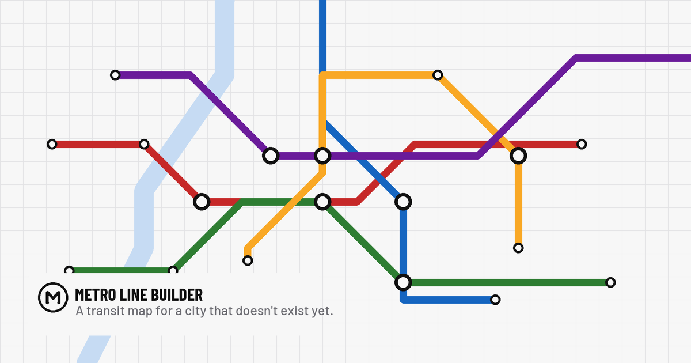

<div align="center">


# Metro Line Builder

**Draw a transit map for a city that doesn't exist yet.**

A schematic metro-map editor that runs in the browser — lines, stations, interchanges, rivers, parks and landmarks, drawn the way real transit maps are: orthogonal and 45° routes, colour-coded services, a name card on every stop.

[**Open the app →**](https://vgomx.github.io/metro-line-builder/)

[](LICENSE)




</div>

## Features

- **Draw lines** along a Beck-style grid — every segment snaps to horizontal, vertical, or 45°, the way a schematic map is built.
- **Stations and interchanges** — ordinary stops, transfer stations where lines cross, and principal stations, each with a name card placed to avoid its neighbours.
- **Geography** — rivers and parks drawn as freehand polygons, sitting under the network.
- **Landmarks** — a palette of curated place symbols (from OpenMoji) plus a few drawn for this app, dropped anywhere on the map.
- **A whole city in one click** — *Surprise me* generates a complete network: lines, stations, a river, parks and landmarks, placed so nothing overlaps.
- **Multiple maps** — every map you draw is kept in the browser and reachable from the Open dialog, with a thumbnail of each network.
- **Export** — as a **PNG** or **SVG** picture to share, or as **JSON** to open again later.
- **Installable** — add it to a home screen or dock and it runs offline, like a native app.
- **Works with a finger** — full touch support, so it's usable on a tablet.
- **Light and dark** themes, honours `prefers-reduced-motion`, and keyboard-navigable throughout.

Nothing you draw leaves your device: the app has no backend, and every map lives in your browser's local storage until you export it.

## Keyboard & gestures

| | |
|---|---|
| **Tools** | `V` select · `P` draw line · `S` add station · `H` pan · `R` river · `G` park · `I` landmark |
| **While drawing** | `Enter` finish · `Backspace` take back a point · `Esc` cancel |
| **Editing** | double-click to rename · `Delete` remove selection · `Cmd/Ctrl+Z` undo · `Cmd/Ctrl+Shift+Z` redo |
| **View** | scroll to pan · pinch to zoom · hold `Space` to pan without changing tool |
| **Help** | `?` opens the full shortcut list in the app |

## Getting started

This app uses [`metro-ds`](https://github.com/vgomx/metro-ds), its design system, as a local `file:` dependency — so it expects `metro-ds` checked out as a **sibling directory**:

```
some-folder/
├── metro-line-builder/   (this repo)
└── metro-ds/
```

Requires **Node 22+**.

```sh
# 1. build the design system
cd metro-ds
npm install && npm run build

# 2. run the app
cd ../metro-line-builder
npm install
npm run dev
```

The dev server prints a local URL — open it and you'll land on the welcome screen.

### Scripts

| Command | Does |
|---|---|
| `npm run dev` | Start the Vite dev server with hot reload. |
| `npm run build` | Type-check and produce a production build in `dist/`. |
| `npm run preview` | Build, then serve the production bundle locally. |
| `npm run lint` | Run [oxlint](https://oxc.rs) over the source. |

## Tech

- **[React 19](https://react.dev)** + **TypeScript** (strict), built with **[Vite](https://vite.dev)**.
- **[D3-zoom](https://d3js.org/d3-zoom)** for pan and zoom over an SVG canvas; all rendering is hand-written SVG, no chart library.
- **[metro-ds](https://github.com/vgomx/metro-ds)** — the design system: tokens and components.
- **[ZzFX](https://github.com/KilledByAPixel/ZzFX)** for synthesised UI sounds — no audio files shipped.
- A small **service worker** for offline capability and installability.

State lives in a single reducer with full undo/redo history; maps persist to `localStorage`. There's no server and no build-time data — a generated city is computed in the browser.

## Contributing

Issues and pull requests are welcome. If you're planning something larger than a fix, opening an issue first is the quickest way to know it fits before you spend the time.

Before opening a PR, please make sure `npm run build` and `npm run lint` both pass. The codebase leans on comments that explain *why* a piece of code is the way it is rather than what it does — matching that is the most useful style note.

## License

[MIT](LICENSE) © 2026 [Vitor Gomes](https://vitorgomes.design)

Map symbols are from [OpenMoji](https://openmoji.org) under CC BY-SA 4.0. Full third-party notices are in the app under **More → Legal**.
